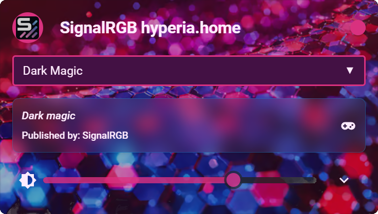
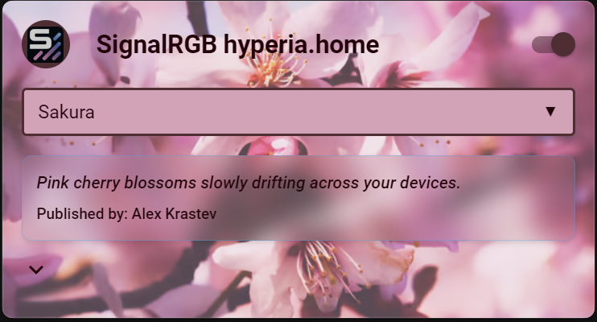
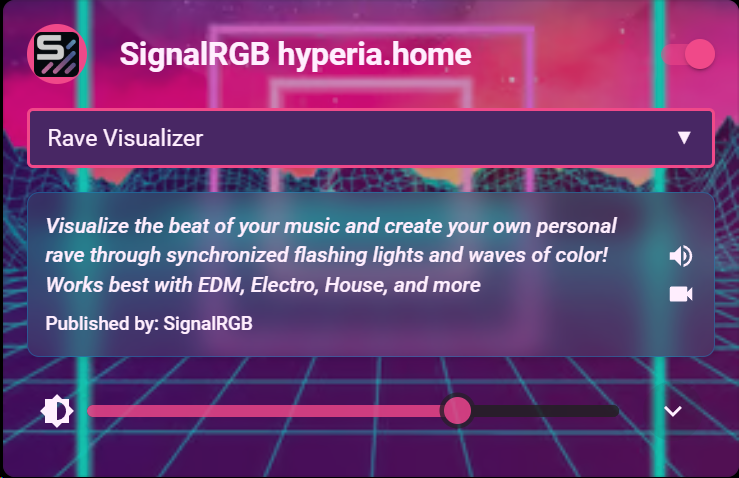
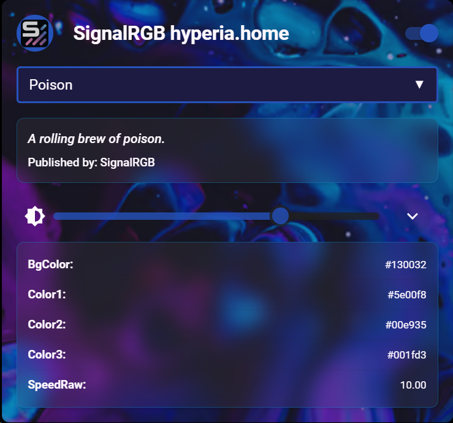
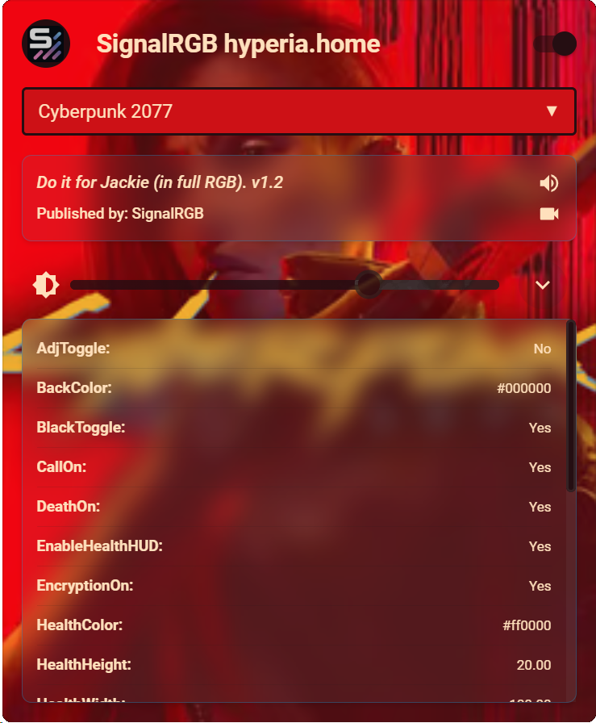
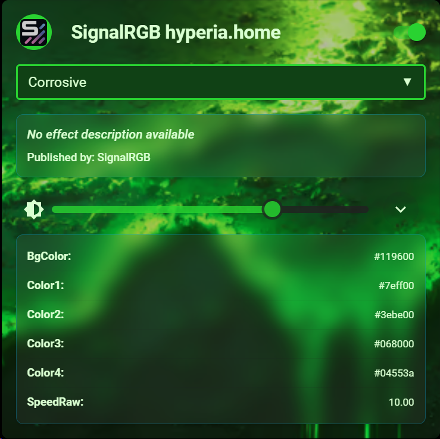

# 🌟 hyper-light-card for Home Assistant

<div align="center">

[![HACS Custom][hacs-shield]][hacs]
[![GitHub Release][releases-shield]][releases]
[![License][license-shield]](LICENSE)

_A dazzling custom card for controlling SignalRGB and Hypercolor lights through Home Assistant_

[Installation](#installation) • [Configuration](#configuration) • [Usage](#usage) • [Troubleshooting](#troubleshooting) • [Contributing](#contributing) • [License](#license)

</div>

## 🎮 Features

- 💅 Sleek, modern design that adapts to your effect's color palette
- 🔮 Animated Hypercolor brand mark that glows to life with the light
- 🎨 Dynamic color extraction with automatic UI theming, falling back cleanly to your Home Assistant theme when the effect art can't be read
- 🔌 Auto-detects whether your light is a SignalRGB or Hypercolor entity
- 📱 Responsive layout for desktop and mobile, with native HA section sizing
- 🔀 Effect switching with an intelligent dropdown menu that highlights and scrolls to the running effect
- ⌨️ Keyboard-navigable selectors with visible focus rings
- ℹ️ Rich effect info: description, publisher, and tag chips
- 🎛️ Full effect controls: sliders, toggles, palette pickers, and color swatches
- 📊 Layout and preset selection for SignalRGB
- 🎬 Scenes and profiles for Hypercolor, with live runtime controls
- 🗺️ Scene zone controls for tuning each render group's brightness and power
- 🎧 Audio controls for toggling reactivity and picking the input device
- 🛰️ Status chips for FPS, audio reactivity, and connectivity (Hypercolor)
- 🧩 Per-device drilldown for grouped Hypercolor installs
- ⏭️ Effect navigation controls (next, previous, random)
- 💡 Animated power toggle with color-aware feedback
- 🔆 Smooth brightness control slider
- 🔧 Visual editor with backend-aware schema (powered by `ha-form`)

## 🌈 Screenshots

<table>
  <tr>
    <td></td>
    <td></td>
    <td></td>
  </tr>
  <tr>
    <td></td>
    <td></td>
    <td></td>
  </tr>
</table>

## 🛠️ Installation

<a name="installation"></a>

### Prerequisites

- Home Assistant 2024.2.0 or newer
- One of the following light integrations:
  - [SignalRGB Home Assistant Integration](https://github.com/hyperb1iss/signalrgb-homeassistant) (latest SignalRGB beta recommended for full functionality)
  - [Hypercolor Home Assistant Integration](https://github.com/hyperb1iss/hypercolor-hass)

### HACS Installation (Recommended)

1. Make sure you have [HACS](https://hacs.xyz/) installed in your Home Assistant instance.
2. Go to HACS → Frontend → "+ Explore & Download Repositories"
3. Search for "hyper-light-card" and add it.
4. Refresh your browser cache by holding down Ctrl and pressing F5.

NOTE: This component isn't in the official HACS repository yet. You can add it as a custom
repository for now- go to HACS, click on the 3 dots, click custom repositories, and enter
"hyperb1iss/hyper-light-card" for the repository and select "Lovelace" for the
category.

### Manual Installation

1. Download `hyper-light-card.js` from the [latest release](https://github.com/hyperb1iss/hyper-light-card/releases).
2. Copy it into your `config/www` directory.
3. Add the following to your `configuration.yaml`:

   ```yaml
   lovelace:
     resources:
       - url: /local/hyper-light-card.js
         type: module
   ```

4. Restart Home Assistant.

## ⚙️ Configuration

<a name="configuration"></a>

Add the card to your dashboard:

1. Edit your dashboard
2. Click "+ Add Card"
3. Search for "Hyper Light Card" in Custom Cards
4. Choose your light entity and configure options in the visual editor

The visual editor adapts to whichever backend the card detects. Override detection with the `backend` option if you ever need to.

### SignalRGB example

```yaml
type: custom:hyper-light-card
entity: light.signalrgb
name: 'All The RGBeez'
icon: mdi:led-strip-variant
show_effect_info: true
show_effect_parameters: true
show_brightness_control: true
background_opacity: 0.7
layout_entity: select.signalrgb_layout
preset_entity: select.signalrgb_preset
next_effect_entity: button.signalrgb_next_effect
previous_effect_entity: button.signalrgb_previous_effect
random_effect_entity: button.signalrgb_random_effect
show_layout_select: true
show_preset_select: true
show_effect_controls: true
allowed_effects:
  - 'Lava Lamp'
  - 'Bubbles'
  - 'Rave Visualizer'
```

### Hypercolor example

The Hypercolor integration names its entities after the **daemon instance**, not
after the integration. A daemon called `Hyperia` produces `light.hyperia`
alongside `select.hyperia_layout`, `button.hyperia_next_effect`, and so on. Use
whatever your own instance is called:

```yaml
type: custom:hyper-light-card
entity: light.hyperia
name: 'Living Room'
show_status_chips: true
show_live_controls: true
show_scene_select: true
show_profile_select: true
show_audio_controls: true
show_zones: true
show_per_device: false
background_opacity: 0.7
```

> Companion entities (scene/preset/layout selects, live-control numbers, audio
> switch/device selects, status sensors, scene-zone lights, and per-device
> children) are auto-discovered by deriving the sibling name from the entity you
> configure. Point the card at `light.hyperia` and it finds the `hyperia_*`
> helpers on its own. Effect description, publisher, tags, and the full control
> set are read straight from the master light's attributes (published by
> hypercolor-hass), so the info panel and controls populate automatically.

Discovery only fills in options you haven't set, so any helper that lives
somewhere unexpected can be pinned by hand under `hypercolor`:

```yaml
type: custom:hyper-light-card
entity: light.hyperia
backend: hypercolor
hypercolor:
  scene_entity: select.hyperia_scene
  profile_entity: select.hyperia_profile
  stop_effect_entity: button.hyperia_stop_effect
  fps_entity: sensor.hyperia_fps
  connected_entity: binary_sensor.hyperia_connected
  audio_beat_entity: binary_sensor.hyperia_audio_beat
  audio_reactive_active_entity: binary_sensor.hyperia_audio_reactive_active
  audio_energy_entity: sensor.hyperia_audio_energy
  audio_reactive_switch_entity: switch.hyperia_audio_reactive
  audio_device_entity: select.hyperia_audio_device
  live_control_entities:
    brightness: number.hyperia_brightness
    speed: number.hyperia_speed
    hue_shift: number.hyperia_hue_shift
    intensity: number.hyperia_intensity
  zone_lights:
    - light.hyperia_default_zone
  per_device_lights:
    - light.hyperia_lamp_1
  per_device_identify_buttons:
    - button.hyperia_identify_lamp_1
```

### Configuration Options

#### Shared

| Option                    | Type                       | Default                   | Description                                                                |
| ------------------------- | -------------------------- | ------------------------- | -------------------------------------------------------------------------- |
| `entity`                  | string                     | **Required**              | The entity_id of your SignalRGB or Hypercolor light                        |
| `backend`                 | `signalrgb` \| `hypercolor` | _auto-detected_           | Override backend detection. Leave unset unless detection picks the wrong one. |
| `name`                    | string                     | `friendly_name` of entity | Card title                                                                 |
| `icon`                    | string                     | backend default           | Icon to display (SignalRGB uses the brand icon URL; Hypercolor uses the animated Hypercolor brand mark). Set any `mdi:` token or image URL to override. |
| `background_opacity`      | number                     | `0.7`                     | Opacity of the effect image background (0-1)                               |
| `show_effect_info`        | boolean                    | `true`                    | Show effect description and publisher                                      |
| `show_effect_parameters`  | boolean                    | `true`                    | Display effect parameters                                                  |
| `show_brightness_control` | boolean                    | `true`                    | Display brightness slider                                                  |
| `show_effect_controls`    | boolean                    | `true`                    | Show effect navigation (next, previous, random)                            |
| `show_layout_select`      | boolean                    | `true`                    | Show layout dropdown when a layout source is available                     |
| `show_preset_select`      | boolean                    | `true`                    | Show preset dropdown when a preset source is available                     |
| `allowed_effects`         | string[]                   | _all effects_             | Limit the effect dropdown. Empty means all available effects.              |

#### SignalRGB

| Option                   | Type   | Default     | Description                                        |
| ------------------------ | ------ | ----------- | -------------------------------------------------- |
| `layout_entity`          | string | _auto_      | Override the SignalRGB layout `select` entity      |
| `preset_entity`          | string | _auto_      | Override the SignalRGB preset `select` entity      |
| `next_effect_entity`     | string | _auto_      | Override the next-effect `button` entity           |
| `previous_effect_entity` | string | _auto_      | Override the previous-effect `button` entity       |
| `random_effect_entity`   | string | _auto_      | Override the random-effect `button` entity         |

These default to the device-scoped helpers exposed by the SignalRGB integration, so they're rarely needed.

#### Hypercolor

| Option                | Type    | Default | Description                                              |
| --------------------- | ------- | ------- | -------------------------------------------------------- |
| `show_scene_select`   | boolean | `true`  | Show the scene selector dropdown                         |
| `show_profile_select` | boolean | `false` | Show the profile selector dropdown                       |
| `show_live_controls`  | boolean | `true`  | Show effect controls (sliders, toggles, palette + color pickers) |
| `show_audio_controls` | boolean | `true`  | Show the audio-reactive toggle and input device selector (when present) |
| `show_zones`          | boolean | `true`  | Show scene zone controls for per-group brightness and power (when present) |
| `show_status_chips`   | boolean | `true`  | Show FPS, audio reactivity, and connectivity chips       |
| `show_per_device`     | boolean | `false` | Show an expandable list of child lights below the card   |

Every selector hides itself when its entity exposes no options, so a card never
shows a dead control. Hypercolor's preset list, for instance, is empty for
effects that have no saved presets, and the Preset dropdown simply won't appear
for those.

#### Hypercolor helper entities

All of these live under the `hypercolor:` key and are auto-discovered from your
instance name. Set one only when you need to override discovery.

| Option                         | Type     | Description                                             |
| ------------------------------ | -------- | ------------------------------------------------------- |
| `scene_entity`                 | string   | Scene `select` entity                                   |
| `profile_entity`               | string   | Profile `select` entity                                 |
| `stop_effect_entity`           | string   | Stop-effect `button` entity                             |
| `fps_entity`                   | string   | Render-rate `sensor` for the FPS chip                   |
| `connected_entity`             | string   | Daemon connectivity `binary_sensor`                     |
| `audio_beat_entity`            | string   | Beat `binary_sensor`; drives the icon pulse             |
| `audio_reactive_active_entity` | string   | Audio-reactive `binary_sensor` for the status chip      |
| `audio_energy_entity`          | string   | Audio energy `sensor`                                   |
| `audio_reactive_switch_entity` | string   | Audio-reactive `switch` shown in the audio controls     |
| `audio_device_entity`          | string   | Audio input device `select`                             |
| `live_control_entities`        | map      | `brightness` / `speed` / `hue_shift` / `intensity` to `number` entities |
| `zone_lights`                  | string[] | Scene render-group lights backing the Zones section     |
| `per_device_lights`            | string[] | Child lights for the per-device drilldown               |
| `per_device_identify_buttons`  | string[] | Identify `button` entities matched to those children    |

## 🚀 Usage

<a name="usage"></a>

hyper-light-card adapts to whichever backend it detects:

- **Power Toggle**: Click the light icon to turn the light on or off.
- **Effect Selection**: Use the dropdown to choose from available effects.
- **Layout & Preset / Scene & Profile**: SignalRGB exposes layouts and presets; Hypercolor exposes scenes and (optionally) profiles.
- **Effect Navigation**: Cycle through effects with next, previous, and random buttons.
- **Brightness Control**: Adjust brightness with the slider.
- **Live Controls**: Drag Hypercolor's intensity, speed, and parameter sliders without flooding the bus. Input is coalesced while you drag and committed on release.
- **Keyboard**: Tab to any selector, then Enter or Space to open it and to pick a row.
- **Status Chips**: Hypercolor surfaces FPS, audio reactivity, and connectivity at a glance.
- **Per-Device Drilldown**: Expand grouped Hypercolor installs to see and toggle each child light.
- **Effect Info & Parameters**: Description, publisher, and current parameter values for the running effect.

The card pulls its accent palette from the running effect image, giving each effect its own coherent look. The extracted background is measured against the WCAG relative-luminance threshold to pick black or white foreground text, so labels stay readable on any cover art.

When the effect image can't be read, the card leaves its color variables unset and inherits your Home Assistant theme instead. See [Troubleshooting](#troubleshooting) if you expected palette colors and got theme colors.

## 🩺 Troubleshooting

<a name="troubleshooting"></a>

**The card uses my Home Assistant theme colors instead of the effect's palette.**
Palette extraction reads the effect cover image through a canvas, which browsers
only allow for images served with permissive CORS headers. Hypercolor serves
cover art from the daemon's own origin, and the daemon allows loopback origins
plus anything listed in its `web.cors_origins` config. If you reach Home
Assistant at a hostname rather than `localhost`, add that exact origin (scheme,
host, and port, for example `http://homeassistant.local:8123`) to the daemon's
`cors_origins` and reload. Until then the card degrades to your theme rather
than rendering unstyled.

**The Preset dropdown never appears.**
Hypercolor's preset `select` lists only presets saved for the effect that is
currently running, so it is empty for effects you have never saved a preset for.
The card hides selectors with no options, so the dropdown is absent rather than
disabled. Save a preset for the running effect and it appears.

**A Hypercolor light is detected as SignalRGB.**
Detection uses attributes the Hypercolor light publishes (`effect_controls`,
`active_effect_id`, `zone_count`). A light that is unavailable at page load may
not expose them yet. Set `backend: hypercolor` to pin it.

**Companion entities aren't discovered.**
Discovery derives sibling names from the entity you configure, so it expects
`select.<instance>_layout` next to `light.<instance>`. If you have renamed
entity IDs away from that pattern, wire them explicitly under `hypercolor:`.

## 👩‍💻 Development

<a name="development"></a>

This project uses a modern toolchain:

- **[Bun](https://bun.com/)** as package manager and script runner
- **[Vite 8](https://vite.dev/) (Rolldown)** for production builds
- **[Vitest 4](https://vitest.dev/)** with V8 coverage for tests
- **[Biome 2](https://biomejs.dev/)** for linting plus JSON/CSS formatting
- **[Prettier 3](https://prettier.io/)** scoped to TS/JS (Lit `html` template formatting)
- **TypeScript 6** with strict mode and Lit's experimental decorators
- **[Lit 3](https://lit.dev/)** for reactive web components
- **ColorThief** for palette extraction, with a WCAG luminance check picking the foreground color

### Getting Started

```bash
# Install dependencies
bun install

# Build + copy to your Home Assistant www folder
bun run dev

# Run the test suite
bun run test

# Lint, format, and typecheck
bun run lint
bun run format:check
bun run typecheck

# Production build
bun run build
```

`bun run dev` reads `config.js` for your Home Assistant config path and copies the built bundle into `<hass>/www/hyper-light-card/`. Refresh your dashboard to pick up changes.

### Releases

Tagging `vX.Y.Z` on `main` triggers the GitHub Actions workflow, which builds, runs the gates, and attaches the bundle to a GitHub release via [shared-workflows](https://github.com/hyperb1iss/shared-workflows). HACS picks it up automatically.

## 🤝 Contributing

<a name="contributing"></a>

Contributions are what make the open-source community such a fantastic place to learn, inspire, and create. Any contributions you make are **greatly appreciated**. Please see our [CONTRIBUTING.md](CONTRIBUTING.md) file for more details on how to get started.

## 📄 License

<a name="license"></a>

Distributed under the Apache License 2.0. See `LICENSE` for more information.

---

<div align="center">

📚 [Documentation](https://github.com/hyperb1iss/hyper-light-card/wiki) • 🐛 [Report Bug](https://github.com/hyperb1iss/hyper-light-card/issues) • 💡 [Request Feature](https://github.com/hyperb1iss/hyper-light-card/issues)

</div>

## 💖 Acknowledgements

- [SignalRGB](https://www.signalrgb.com/) for their amazing RGB control software
- [Hypercolor](https://github.com/hyperb1iss/hypercolor-hass) for the multi-light orchestration backend
- [Home Assistant](https://www.home-assistant.io/) for the incredible smart home platform
- [ColorThief](https://lokeshdhakar.com/projects/color-thief/) for color extraction capabilities
- [Lit](https://lit.dev/) for the powerful web components framework

---

<div align="center">

Created by [Stefanie Jane 🌠](https://github.com/hyperb1iss)

If you find this project useful, [buy me a Monster Ultra Violet!](https://ko-fi.com/hyperb1iss) ⚡️

</div>

[hacs-shield]: https://img.shields.io/badge/HACS-Custom-pink.svg?style=for-the-badge
[hacs]: https://github.com/custom-components/hacs
[releases-shield]: https://img.shields.io/github/release/hyperb1iss/hyper-light-card.svg?style=for-the-badge
[releases]: https://github.com/hyperb1iss/hyper-light-card/releases
[license-shield]: https://img.shields.io/github/license/hyperb1iss/hyper-light-card.svg?style=for-the-badge
