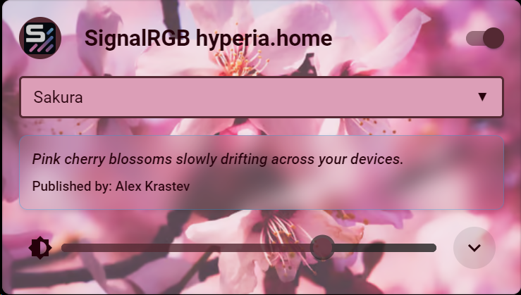

# 🌟 hyper-light-card for Home Assistant

<div align="center">

[![HACS Custom][hacs-shield]][hacs]
[![GitHub Release][releases-shield]][releases]
[![License][license-shield]](LICENSE)

*A dazzling custom card for controlling SignalRGB through Home Assistant*

[Installation](#installation) • [Configuration](#configuration) • [Usage](#usage) • [Contributing](#contributing) • [License](#license)

</div>

## ✨ Features

- 💅 Sleek, modern design that adapts to your SignalRGB effects
- 🎨 Dynamic color palette based on the current effect
- 📱 Responsive layout for both desktop and mobile
- 🔀 Easy effect switching with a dropdown menu
- 💡 Intuitive on/off toggle
- ℹ️ Detailed effect information display
- 🔧 Customizable card appearance

## 🌈 Screenshots
<table>
  <tr>
    <td></td>
    <td></td>
    <td></td>
  </tr>
  <tr>
    <td></td>
    <td></td>
    <td></td>
  </tr>
  <tr>
    <td></td>
    <td></td>
  </tr>
</table>

## 🛠️ Installation
<a name="installation"></a>

### Prerequisites

- Home Assistant 2024.2.0 or newer
- [SignalRGB Home Assistant Integration](https://github.com/hyperb1iss/signalrgb-homeassistant) (Required)

### HACS Installation (Recommended)

1. Make sure you have [HACS](https://hacs.xyz/) installed in your Home Assistant instance.
2. Go to HACS → Frontend → "+ Explore & Download Repositories"
3. Search for "hyper-light-card" and add it.
4. Refresh your browser cache by holding down Ctrl and pressing F5.

NOTE: This component isn't in the official HACS repository yet. You can add it as a custom
repository for now- go to HACS, click on the 3 dots, click custom repositories, and enter
"hyperb1iss/hyper-light-card" for the repository and select "Lovelace" for the
category.

### Manual Installation

1. Download `hyper-light-card.js` from the [latest release](https://github.com/hyperb1iss/hyper-light-card/releases).
2. Copy it into your `config/www` directory.
3. Add the following to your `configuration.yaml`:

   ```yaml
   lovelace:
     resources:
       - url: /local/hyper-light-card.js
         type: module
   ```

4. Restart Home Assistant.

## ⚙️ Configuration
<a name="configuration"></a>

Add the card to your dashboard:

1. Edit your dashboard
2. Click "+ Add Card"
3. Search for "Hyper Light Card" in Custom Cards
4. Choose your SignalRGB entity

Or add it manually to your Lovelace configuration:

```yaml
type: custom:hyper-light-card
entity: light.signalrgb
name: "All The RGBeez"
icon: mdi:led-strip-variant
show_effect_info: true
show_effect_parameters: true
background_opacity: 0.7
```

### Configuration Options

| Option | Type | Default | Description |
|--------|------|---------|-------------|
| `entity` | string | **Required** | The entity_id of your SignalRGB light |
| `name` | string | `friendly_name` of entity | Card title |
| `icon` | string | `mdi:led-strip-variant` | Icon to display |
| `show_effect_info` | boolean | `true` | Show effect description and publisher |
| `show_effect_parameters` | boolean | `true` | Display effect parameters |
| `background_opacity` | number | `0.7` | Opacity of the effect image background (0-1) |

## 🚀 Usage
<a name="usage"></a>

hyper-light-card provides an intuitive interface for controlling your SignalRGB setup:

- **Power Toggle**: Click the switch to turn your SignalRGB setup on or off.
- **Effect Selection**: Use the dropdown to choose from available effects.
- **Effect Info**: View the current effect's description and publisher (if enabled).
- **Effect Parameters**: See detailed parameters for the current effect (if enabled).

The card dynamically adapts its color scheme based on the current effect, creating a cohesive and stylish look for your dashboard.

## 🤝 Contributing
<a name="contributing"></a>

Contributions are what make the open-source community such a fantastic place to learn, inspire, and create. Any contributions you make are **greatly appreciated**. Please see our [CONTRIBUTING.md](CONTRIBUTING.md) file for more details on how to get started.

## 📄 License
<a name="license"></a>

Distributed under the Apache License 2.0. See `LICENSE` for more information.

---

<div align="center">

📚 [Documentation](https://github.com/hyperb1iss/hyper-light-card/wiki) • 🐛 [Report Bug](https://github.com/hyperb1iss/hyper-light-card/issues) • 💡 [Request Feature](https://github.com/hyperb1iss/hyper-light-card/issues)

</div>

## 💖 Acknowledgements

- [SignalRGB](https://www.signalrgb.com/) for their amazing RGB control software
- [Home Assistant](https://www.home-assistant.io/) for the incredible smart home platform

---

<div align="center">

Created by [Stefanie Jane 🌠](https://github.com/hyperb1iss)

If you find this project useful, [buy me a Monster Ultra Violet!](https://ko-fi.com/hyperb1iss)! ⚡️

</div>

[hacs-shield]: https://img.shields.io/badge/HACS-Custom-pink.svg
[hacs]: https://github.com/custom-components/hacs
[releases-shield]: https://img.shields.io/github/release/hyperb1iss/hyper-light-card.svg
[releases]: https://github.com/hyperb1iss/hyper-light-card/releases
[license-shield]: https://img.shields.io/github/license/hyperb1iss/hyper-light-card.svg
